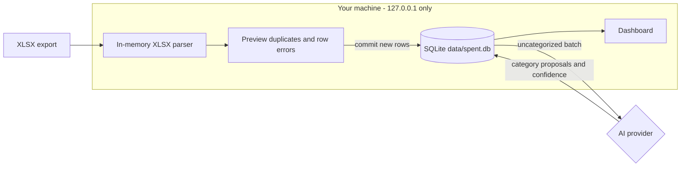

<div align="center">

<picture>
  <source media="(prefers-color-scheme: dark)" srcset="public/logo_darkmode.svg">
  
</picture>

# Spent

**Local-only personal finance for Israeli accounts.**
XLSX imports. AI-categorized. Yours.

[](https://shaya16.github.io/Spent/)
[](https://shaya16.github.io/Spent/getting-started)
[](https://shaya16.github.io/Spent/install/mac)

[](https://nextjs.org/)
[](https://react.dev/)
[](https://www.typescriptlang.org/)
[](https://sqlite.org/)
[](#license)
[](#features)

</div>

> [!WARNING]
> Personal, local-only tool. The default app flow imports local XLSX files and does not ask for bank credentials. If you enable scraper sync in code, bank automation may violate financial institutions' Terms of Service. Use only for your own accounts on your own machine. **Do not deploy as a hosted service.**

<div align="center">


</div>

## Why Spent?

Israeli financial exports are awkward, YNAB does not handle ILS the way many local users expect, and cloud finance apps usually ask you to hand over sensitive account data. Spent is for people who would rather run a personal finance app on their own laptop.

The current app flow is file-first. Export XLSX files from supported Israeli institutions, load them from the dashboard, preview parsed rows and duplicates, and import them into a local SQLite database. Spent can then categorize uncategorized transactions with Claude, local Ollama, or no AI at all.

The trade-off is honest: you self-host, keep the database on your machine, and choose when to import files. In return you get a fast, polished, offline-friendly dashboard that never phones home except to the AI provider you configure.

## Features

<table>
<tr>
<td width="33%" valign="top">

### 📄 XLSX imports
Load local XLSX files from Max, Isracard, CAL, Hapoalim, and Leumi templates. Files are parsed in memory, previewed, deduplicated, and then committed.

</td>
<td width="33%" valign="top">

### 🤖 AI categorization
Choose Claude for best accuracy, Ollama for local LLMs, or no AI. Categorization runs in batches and low-confidence results are marked for review.

</td>
<td width="33%" valign="top">

### 🔒 Local-only storage
Transactions, settings, budgets, and sensitive settings live in local SQLite under `data/`. The production service binds to `127.0.0.1`.

</td>
</tr>
<tr>
<td valign="top">

### 📊 Budgets with pacing
Hierarchical categories, monthly targets, pacing cards, per-category drilldowns, and statistics-based budget review help you see where the month is going.

</td>
<td valign="top">

### 🌓 Light and dark theme
Polished light and dark themes with system-aware defaults, comfortable spacing, and responsive dashboard cards.

</td>
<td valign="top">

### 🍎 Menu bar and tray app
Native companion in the macOS menu bar or Windows notification area. Open the dashboard and control the local service without a terminal.

</td>
</tr>
<tr>
<td valign="top">

### 🎯 Transfers and income
Income and expense categories are tracked separately, with Transfers available on both sides so repayments and account movements net correctly in summaries.

</td>
<td valign="top">

### 🔍 Review workflow
Transactions can be filtered by income, expenses, cards, bank accounts, and pending review. The dashboard surfaces rows that need attention.

</td>
<td valign="top">

### 🧠 Merchant memory
When you correct a category, Spent remembers the merchant so future matching transactions are assigned faster.

</td>
</tr>
<tr>
<td colspan="3" valign="top">

### 🌐 English and Hebrew (RTL)
Toggle between English (default) and עברית from **Settings → Appearance**. Hebrew flips the app to right-to-left with translated UI, bank names, predefined categories, currency, and date formatting. Powered by [`next-intl`](https://next-intl.dev/). Add another language by creating a locale file under [`src/i18n/messages/`](src/i18n/messages/).

</td>
</tr>
</table>

## Screenshots

<table>
<tr>
<td width="50%" align="center"><b>Dashboard - light</b></td>
<td width="50%" align="center"><b>Dashboard - dark</b></td>
</tr>
<tr>
<td></td>
<td></td>
</tr>
<tr>
<td align="center"><b>Transactions</b></td>
<td align="center"><b>Setup wizard</b></td>
</tr>
<tr>
<td></td>
<td></td>
</tr>
<tr>
<td align="center"><b>Categories</b></td>
<td align="center"><b>AI provider</b></td>
</tr>
<tr>
<td></td>
<td></td>
</tr>
<tr>
<td colspan="2" align="center"><b>Bank accounts</b></td>
</tr>
<tr>
<td colspan="2"></td>
</tr>
</table>

## How it works



The default flow keeps bank credentials out of the app. XLSX files are read in memory by the browser/server request, previewed, and written into `data/spent.db` only after you click Import. The only optional outbound traffic is to `api.anthropic.com` for Claude or `localhost:11434` for Ollama.

## Supported import formats

| Institution | Source type | Template |
|---|---|---|
| **Max** | Credit card | `max_bill` |
| **Isracard** | Credit card | `isracard_bill` |
| **CAL** | Credit card | `cal_bill` |
| **Bank Hapoalim** | Bank account | `hapoalim_bank_account` |
| **Bank Leumi** | Bank account | `leumi_bank_account` |

The parser definitions live in [`src/lib/imports/templates.js`](src/lib/imports/templates.js) and [`src/lib/imports/xlsx-parser.js`](src/lib/imports/xlsx-parser.js). Adding another XLSX format means adding a template definition, parser branch, and tests.

### Scraper sync status

The repository still contains the encrypted-credential scraper integration built around [`israeli-bank-scrapers`](https://github.com/eshaham/israeli-bank-scrapers), but the shipped UI currently has scraper sync disabled with:

```ts
export const ENABLE_SCRAPER_SYNC = false;
```

That flag is in [`src/lib/features.ts`](src/lib/features.ts). With the flag off, setup starts at AI selection, the dashboard shows **Load transactions**, and bank credential settings are hidden.

## AI providers

| | **Claude** (Anthropic) | **Ollama** (local) | **None** |
|---|---|---|---|
| Cost | Paid API usage | Free | Free |
| Accuracy | Best | Good, model-dependent | Manual |
| Network | `api.anthropic.com` | `localhost:11434` | Offline |
| Setup | API key | Install Ollama and pull a model | Nothing |

Default Claude model: `claude-haiku-4-5-20251001`.

Default Ollama model: `llama3.2:3b`.

You can change providers any time from **Settings → AI**. Existing categorizations are kept.

## Requirements

- **Node.js 22+**
- **macOS 13+**, **Ubuntu 22+** with systemd, or **Windows 11**
- **Build tools for the menubar or tray app** if you want the native companion:
  - macOS: Xcode Command Line Tools with `xcode-select --install`
  - Windows: .NET 8 SDK with `winget install Microsoft.DotNet.SDK.8`
- XLSX exports from a supported template
- Optional: Claude API key or local Ollama

## Install

> Prefer a screenshot-by-screenshot walkthrough? The [step-by-step install guides](https://shaya16.github.io/Spent/getting-started/) on the docs site cover macOS and Windows separately, with build-tool setup and tray-app details.

```bash
git clone https://github.com/Shaya16/Spent.git
cd Spent
npm install
npm run setup
```

`npm run setup` builds the Next.js app, installs the always-on service, builds the platform menubar or tray app when supported, registers it to auto-start, and opens the dashboard. On Windows it also writes a `127.0.0.1 spent.localhost` line to your hosts file, which asks for Administrator approval.

On Linux there is no native menubar. `npm run setup` installs the service and opens the browser. Control the service with `npm run service:*`.

First launch of the menubar on macOS or Windows can show an unsigned-binary warning from Gatekeeper or SmartScreen. That is expected for a locally built app. Use right-click, Open on macOS, or More info, Run anyway on Windows.

Open **`http://spent.localhost:41234`** and bookmark it.

## First-time setup

In the browser:

1. **Choose an AI provider** - Claude, Ollama, or none.
2. **Set your monthly ceiling** - total spend you want to stay under each month.
3. **Set per-category budgets** - type an amount on any category to budget it, or leave it blank to track without a limit.
4. **Open the dashboard**.
5. **Load transactions** - click **Load transactions**, choose XLSX files, select each file's source type and template, preview, then import.

## Importing transactions

The dashboard import dialog supports multiple files at once.

1. Click **Load transactions**.
2. Choose `.xlsx` files.
3. For each file, select **Credit card** or **Bank account** and the matching template.
4. Click **Preview** to see parsed row counts, duplicate counts, and row-level errors.
5. Click **Import**. New rows are inserted, duplicates are skipped by the composite dedup hash, and AI categorization runs if a provider is connected.

Imported rows use provider IDs that match their template, such as `max_bill`, `isracard_bill`, `cal_bill`, `hapoalim_bank_account`, or `leumi_bank_account`. The transactions page can filter totals and rows by cards, bank accounts, income, expenses, and pending review.

Positive bank-account rows are treated as income. Common transfer-like movements, including credit-card payments and account transfers, can be categorized as Transfers. Expense-side transfer totals include outgoing transfers, while income-side Transfers subtract from those totals so moving money between accounts does not inflate spending.

## Reviewing budget statistics

After importing and categorizing transactions, open **Settings -> Categories** and click **Calculate statistics**. Spent opens a statistics review page instead of applying changes immediately.

On that page you can:

1. Choose how many complete months to include in the calculation.
2. Compare each category's current budget with its mean and median spend.
3. Pick current, mean, median, or type any custom monthly amount.
4. Review the suggested monthly target.
5. Click **Apply budgets** only when the chosen numbers look right.

The statistics are calculated from transactions already stored in the local SQLite database. Transfer statistics use the same signed treatment as the dashboard, so incoming transfer rows reduce the transfer total instead of appearing as ordinary income. Saving writes only the numbers you selected.

## How you will use it

| What you want | Run or open |
|---|---|
| Just use the app | `http://spent.localhost:41234` |
| Code and see changes instantly | `npm run dev` then `http://127.0.0.1:3000` |
| Update the always-on app after editing | `npm run service:reload` |
| Test XLSX parsers and templates | `npm run test:imports` |
| Test transaction logic helpers | `npm run test:logic` |

Rare cases:

- Changed the menu bar app source: run `npm run menubar:install:mac` or `npm run menubar:install:windows`.
- Changed install scripts or hostname: run `npm run service:uninstall` and then `npm run service:install`.

## Service commands

| Command | What it does |
|---|---|
| `npm run service:status` | Shows whether the service is running and bound to loopback |
| `npm run service:start` / `npm run service:stop` | Starts or stops the local service |
| `npm run service:reload` | Rebuilds and restarts |
| `npm run service:logs` | Tails server logs |
| `npm run service:open` | Opens the app in your browser |
| `npm run service:uninstall` | Removes auto-start and the hosts entry. `data/` is untouched |

## Uninstall

```bash
npm run uninstall
```

This reverses what `npm run setup` installed:

- Stops the background service and removes the LaunchAgent, Task Scheduler entry, or systemd unit.
- Windows: removes the `127.0.0.1 spent.localhost` line from your hosts file after Administrator approval.
- Quits the menubar or tray app, removes the installed app, and removes it from Login Items or Startup.

**Kept on purpose:**

- `data/`: your transactions, budgets, settings, and encryption key.
- The repo itself.

To wipe all local app data, delete `data/`.

## Security at a glance

| Concern | Defense |
|---|---|
| Local data | SQLite database under `data/`, WAL mode, gitignored |
| Sensitive settings | AES-256-GCM for encrypted settings such as Claude API keys and scraper credentials when scraper mode is enabled |
| Network exposure | Production service binds to `127.0.0.1` only |
| Browser CSRF | Origin and Referer validation on mutation routes |
| File import | XLSX files are parsed in memory and committed only after preview |
| Bundle integrity | Native and scraper packages are pinned in `package-lock.json` |
| Browser hardening | Strict CSP, `X-Frame-Options: DENY`, and a restrictive `Permissions-Policy` |

Turn on full-disk encryption with FileVault, BitLocker, or LUKS. The encryption key file sits next to the database, so disk-level protection matters if the laptop is lost.

Full threat model and responsible-disclosure policy: [SECURITY.md](SECURITY.md).

## Where your data lives

- `data/spent.db` - transactions, categories, budgets, settings, workspaces, import metadata
- `data/.encryption-key` - 32-byte AES key, mode `0600`
- `~/Library/Logs/Spent/` on macOS, `~/.local/state/spent/log/` on Linux - service logs

Back up `data/` like any other folder. To migrate to a new machine, copy `data/` over and run `npm run service:install`.

## Architecture and code map

```
spent/
├── src/
│   ├── app/                  Next.js App Router routes and APIs
│   │   ├── (dashboard)/      Dashboard, transactions, budget, settings pages
│   │   ├── api/              Import, categorize, sync, summary, transactions, setup
│   │   └── setup/            First-run wizard
│   ├── components/
│   │   ├── dashboard/        Dashboard actions, import button, cards, tables
│   │   ├── setup/            AI, target, budgets, completion steps
│   │   ├── settings/         Settings sections
│   │   └── transactions/     Filters, widgets, transaction page
│   ├── i18n/                 English and Hebrew messages
│   ├── lib/                  Shared types, API client, import parsers, UI helpers
│   └── server/
│       ├── ai/               Claude and Ollama providers plus response parsing
│       ├── db/               SQLite singleton, migrations, query helpers
│       ├── imports/          Import preview and commit flow
│       ├── lib/              Encryption, dedup, transfers, pacing, workspace helpers
│       ├── scrapers/         Disabled-by-default scraper wrapper
│       └── sync/             Shared categorization orchestration
├── menubar/                  macOS and Windows native companions
├── scripts/                  Setup, service, docs screenshots, focused tests
├── website/                  Astro and Starlight docs site
├── .github/workflows/        Docs deploy workflow
├── Spent.sln                 Visual Studio solution for the Windows tray app
└── data/                     SQLite database and encryption key, gitignored
```

## Testing the app

Run locally:

```bash
npm run dev
```

The dev server starts on `127.0.0.1:3000`.

For end-to-end testing without importing files, mark setup complete by choosing no AI:

```typescript
fetch("/api/setup/ai", {
  method: "POST",
  headers: { "Content-Type": "application/json" },
  body: JSON.stringify({ provider: "none" }),
});
```

Focused checks for imports and dashboard logic:

```bash
npm run test:imports
npm run test:logic
```

To reset state, delete `data/spent.db*` and `data/.encryption-key`.

## Troubleshooting

> The [Troubleshooting docs](https://shaya16.github.io/Spent/troubleshooting/) cover Defender, Gatekeeper, service issues, and bank-specific quirks in more depth.

- **Port 41234 in use**: use `lsof -nP -iTCP:41234 -sTCP:LISTEN` on Unix or `netstat -ano | findstr :41234` on Windows. Stop the process and rerun setup.
- **Gatekeeper blocks `Spent.app`**: right-click, Open, Open. One-time.
- **Linux: "systemd user instance not available"**: run `loginctl enable-linger $USER`.
- **Windows: hosts edit fails or `spent.localhost` does not resolve**: rerun install from an elevated PowerShell so it can edit `C:\Windows\System32\drivers\etc\hosts`. `http://127.0.0.1:41234` always works as a fallback.
- **Import preview shows row errors**: check that each file is assigned to the matching template. Max, Isracard, and Hapoalim exports use different headers and date formats.
- **Ollama categorization fails**: make sure Ollama is running and the selected model is installed, for example `ollama pull llama3.2:3b`.

## Roadmap

- [x] Hebrew UI with full RTL layout
- [x] Local XLSX imports for Max, Isracard, CAL, Hapoalim, and Leumi formats
- [x] Card and bank source filters on the transactions page
- [x] Signed income and transfer summaries
- [ ] More import templates
- [ ] CSV / OFX export
- [ ] Custom user-defined categories
- [ ] Re-enable and harden scraper sync behind explicit user choice
- [ ] Mobile companion (Phase 2)
- [ ] Multiple workspaces in the menu bar / tray app

## Contributing

Spent is built for personal use first, open source second. PRs welcome for:

- **New XLSX import templates**: add the template to [src/lib/imports/templates.js](src/lib/imports/templates.js), add parser support in [src/lib/imports/xlsx-parser.js](src/lib/imports/xlsx-parser.js), and cover it with `npm run test:imports`.
- **New bank scraper integrations**: when scraper sync is enabled, add to `BANK_PROVIDERS` in [src/lib/types.ts](src/lib/types.ts), map to `CompanyTypes` in [src/server/scrapers/index.ts](src/server/scrapers/index.ts), and keep credentials server-only.
- **New AI providers**: implement the `AIProvider` interface from [src/server/ai/types.ts](src/server/ai/types.ts), register it in [src/server/ai/factory.ts](src/server/ai/factory.ts), and add setup/settings UI.
- **New languages**: add `<locale>.json` under [src/i18n/messages/](src/i18n/messages/), mirror the keys in `en.json`, and append the locale to [src/i18n/routing.ts](src/i18n/routing.ts).
- **UI polish, bug fixes, documentation.**

Conventions:

- TypeScript strict mode. No `any` without a comment.
- Conventional commits: `feat:`, `fix:`, `chore:`, `docs:`, `refactor:`.
- Comments only where the why is not obvious.
- No em dashes in code, comments, docs, or commit messages.

## License

MIT

## Acknowledgments

Built on the shoulders of:

- [`israeli-bank-scrapers`](https://github.com/eshaham/israeli-bank-scrapers), used by the disabled-by-default scraper path
- [Next.js 16](https://nextjs.org/) and [React 19](https://react.dev/)
- [`shadcn/ui`](https://ui.shadcn.com/) on top of [`base-ui`](https://base-ui.com/)
- [`better-sqlite3`](https://github.com/WiseLibs/better-sqlite3)
- [`next-intl`](https://next-intl.dev/) for English and Hebrew i18n
- [Anthropic Claude](https://www.anthropic.com/) and [Ollama](https://ollama.com/)
